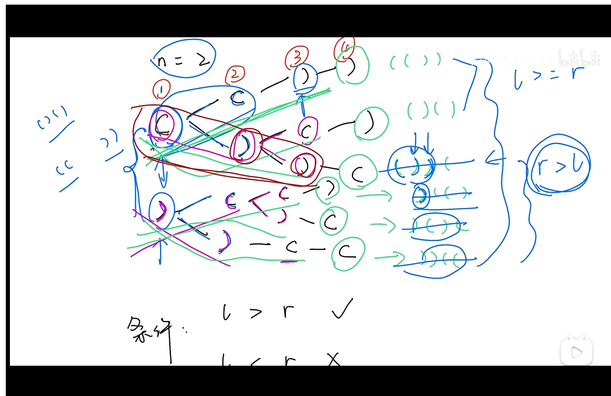
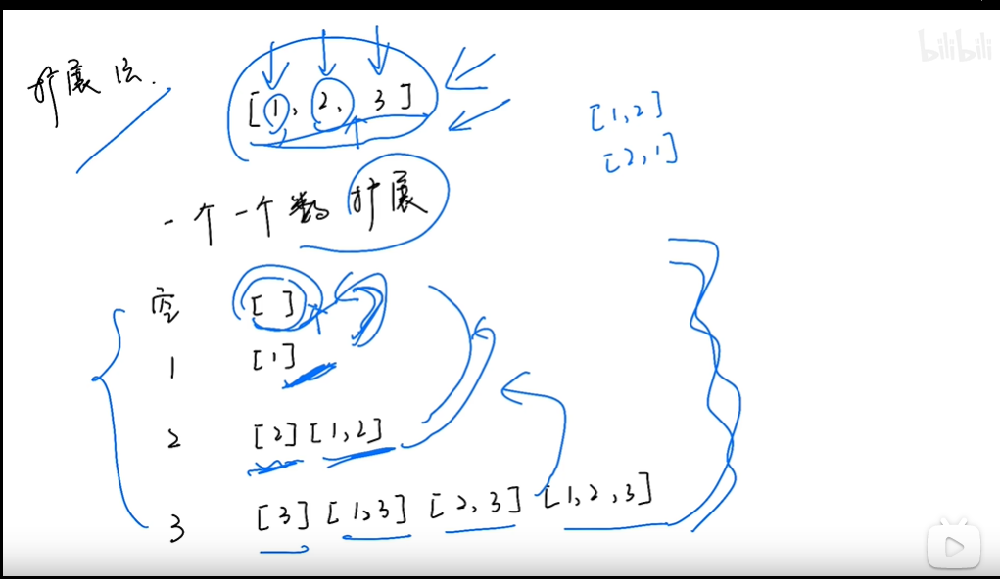

# BackTracking 回溯法

- 类似枚举
- 本质上还是递归

关键词：关键路径，最优解。


例题：

- 22
- 78：代表性回溯题
- 77
- 46
- 经典：八皇后，数独

---

## 题型一

### [22. 括号生成](https://leetcode-cn.com/problems/generate-parentheses/)

难度中等1640收藏分享切换为英文接收动态反馈

数字 `n` 代表生成括号的对数，请你设计一个函数，用于能够生成所有可能的并且 **有效的** 括号组合。

 

**示例 1：**

```
输入：n = 3
输出：["((()))","(()())","(())()","()(())","()()()"]
```

**示例 2：**

```
输入：n = 1
输出：["()"]
```

 

**提示：**

- `1 <= n <= 8`

---

- 方法：
- 题解：https://mp.weixin.qq.com/s/VslFExUGNkYUNWXd91zbkQ
- 视频：https://www.bilibili.com/video/BV1sy4y1q79M?p=65&spm_id_from=pageDriver
- 说明：



- 代码

<details>
  <summary>
      <mark>点击查看详细内容</mark></summary>

```js
/**
 * @param {number} n
 * @return {string[]}
 */
var generateParenthesis = function(n) {
    const list = []
    backtracking(n, list, 0, 0, "");
    return list;
};


function backtracking(n, result, left, right, str) {
    // 右边括号数量大于左边，表示无效括号组合
    if (right > left) {
            return;
        }
    // 左右两边括号数量相等
    if (left == n && right == n) {
        result.push(str);
        return;
    }
    // 左边少了，则左边 + 1
    if (left < n) {
        backtracking(n, result, left+1, right, str+"(");
    }
    // 右边少了，则右边 + 1
    if (right < left) {
        backtracking(n, result, left, right+1, str+")");
    }
}
```
</details>


### [78. 子集](https://leetcode-cn.com/problems/subsets/)

难度中等1059收藏分享切换为英文接收动态反馈

给你一个整数数组 `nums` ，数组中的元素 **互不相同** 。返回该数组所有可能的子集（幂集）。

解集 **不能** 包含重复的子集。你可以按 **任意顺序** 返回解集。

 

**示例 1：**

```
输入：nums = [1,2,3]
输出：[[],[1],[2],[1,2],[3],[1,3],[2,3],[1,2,3]]
```

**示例 2：**

```
输入：nums = [0]
输出：[[],[0]]
```

 

**提示：**

- `1 <= nums.length <= 10`
- `-10 <= nums[i] <= 10`
- `nums` 中的所有元素 **互不相同**


---

解法：

- 方法：
- 视频：https://www.bilibili.com/video/BV1sy4y1q79M?p=66
- 解法：https://mp.weixin.qq.com/s/QyflseNcsZCYG1XnorGx3Q
- 拓展法



<details>
  <summary>
      <mark>点击查看详细内容</mark></summary>

```js
/**
 * @param {number[]} nums
 * @return {number[][]}
 */
var subsets = function(nums) {
    // 例如 nums = [1,2,3]
    const result = []
	result.push([])

    // 遍历所有 nums
	for (let i = 0; i < nums.length; i ++) {
        // 定义临时 子数组-> 子集 数组
	   const sub = []

        // 例如 result = [[], [1], [1,2]]
	   for (let m = 0; m < result.length; m++) {
         // 定义临时变量，暂存 result 的 某一个 子集，也是我们要的结果

         // 例如 result[m] = [1,2], 拷贝一份 temp => [1,2]
	   	 const temp = [].concat(result[m])
         
         // 单数子集，比如 1, 或者 2, 或者 3
	   	 temp.push(nums[i])

         // 多数子集，比如 [[1], [1,2], [1,2,3]]
         sub.push(temp)
	   }

      // 一个个遍历子集，把他们放入 result 中
	   for (let k in sub) {
	   	  result.push(sub[k])
	   }
	}

	return result
};
```
</details>


- 递归回溯法

<details>
  <summary>
      <mark>点击查看详细内容</mark></summary>

```js
/**
 * @param {number[]} nums
 * @return {number[][]}
 */
var subsets = function(nums) {
  const result = []
  for (let i=0; i<= nums.length; i++) {
    backtracking(nums, result, i, 0, []);
  }
  return result
};

// 参数说明  result 子集容器，要找的子集的长度 length，要从哪个位置开始找 index； sub 用于缓存子集结果
function backtracking(nums, result, length, index, sub) {
    // 退出条件-子集的长度等于要找的 index 
    if (sub.length === length) {
        result.push([].concat(sub))
        return
    }

    for (let i = index; i< nums.length; i++) {
        sub.push(nums[i])
        backtracking(nums, result, length, i+1, sub);

        // 删掉最后一个 子集，避免在下一次回溯的时候重复
        sub.pop()
    }
}
```
</details>


- DFS 法

<details>
  <summary>
      <mark>点击查看详细内容</mark></summary>

```js
/**
 * @param {number[]} nums
 * @return {number[][]}
 */
var subsets = function(nums) {
  const result = []
  dfs(nums, result, 0, [])
  return result
};

function dfs (nums, result, index, sub) {
    result.push([].concat(sub))
    if (nums.length === index) return

     for (let i = index; i < nums.length; i++) {
            sub.push(nums[i]);
            dfs(nums, result, i+1, sub);
            sub.pop()
        }
}
```
</details>

