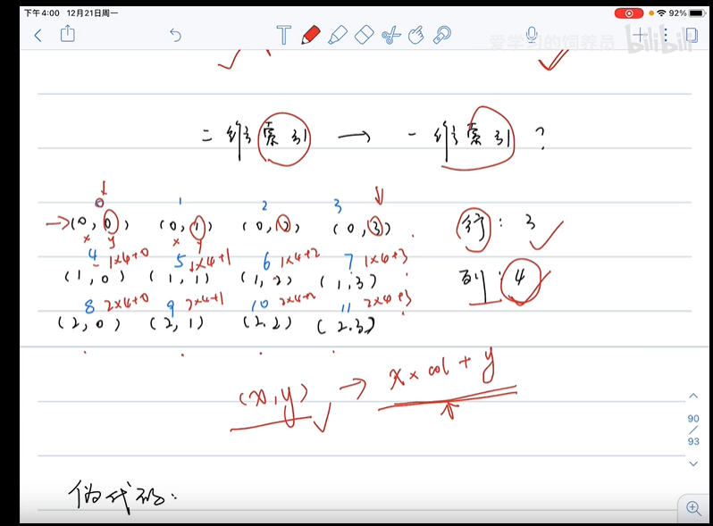

# 二分查找法

- 算法思想：

- 时间复杂度：log2 N

例题：

- 704
- 35
- 162
- 74

## 找位置/目标值

### [704. 二分查找](https://leetcode-cn.com/problems/binary-search/)

难度简单

给定一个 `n` 个元素有序的（升序）整型数组 `nums` 和一个目标值 `target` ，写一个函数搜索 `nums` 中的 `target`，如果目标值存在返回下标，否则返回 `-1`。


**示例 1:**

```
输入: nums = [-1,0,3,5,9,12], target = 9
输出: 4
解释: 9 出现在 nums 中并且下标为 4
```

**示例 2:**

```
输入: nums = [-1,0,3,5,9,12], target = 2
输出: -1
解释: 2 不存在 nums 中因此返回 -1
```

 

**提示：**

1. 你可以假设 `nums` 中的所有元素是不重复的。
2. `n` 将在 `[1, 10000]`之间。
3. `nums` 的每个元素都将在 `[-9999, 9999]`之间。

---

- 方法：
- 题解：
- 答案：


```js
/**
 * @param {number[]} nums
 * @param {number} target
 * @return {number}
 */
var search = function(nums, target) {
    if (!nums.length) return -1
    let left = 0, right = nums.length - 1;
    while(left <= right) {
        // left + (right - left)/2 的作用是避免 left + right 超过边界
        let mid = Math.floor(left + (right - left) / 2)
        if (nums[mid] === target) return mid
        // 中间值小于目标值，左指针右移
        if (nums[mid] < target ) {
            left = mid + 1
        } else {
        // 中间值大于目标值，右指针左移
            right = mid - 1
        }
    }
    return -1
};
```


### [35. 搜索插入位置](https://leetcode-cn.com/problems/search-insert-position/)

难度简单

给定一个排序数组和一个目标值，在数组中找到目标值，并返回其索引。如果目标值不存在于数组中，返回它将会被按顺序插入的位置。

你可以假设数组中无重复元素。

**示例 1:**

```
输入: [1,3,5,6], 5
输出: 2
```

**示例 2:**

```
输入: [1,3,5,6], 2
输出: 1
```

**示例 3:**

```
输入: [1,3,5,6], 7
输出: 4
```

**示例 4:**

```
输入: [1,3,5,6], 0
输出: 0
```

---

- 方法：
- 题解：
- 答案：

```js
/**
 * @param {number[]} nums
 * @param {number} target
 * @return {number}
 */
var searchInsert = function(nums, target) {
    if (!nums || !nums.length) return 0
    let l = 0, r = nums.length - 1;
    
    // 先用 二分法做
    while(l <= r) {
        let mid = Math.floor(l + (r-l)/2)

        if (nums[mid] === target) return mid
        if (nums[mid] < target) {
            l = mid + 1
        } else {
            r = mid -1
        }
    }
    // 二分法没找到，说明不存在，那么此时 左指针和右指针中间，就是 target 该插入的位置，因为 l = mid + 1，所以直接取 l
    return l
};
```


### [162. 寻找峰值](https://leetcode-cn.com/problems/find-peak-element/)

难度中等

峰值元素是指其值大于左右相邻值的元素。

给你一个输入数组 `nums`，找到峰值元素并返回其索引。数组可能包含多个峰值，在这种情况下，返回 **任何一个峰值** 所在位置即可。

你可以假设 `nums[-1] = nums[n] = -∞` 。

 

**示例 1：**

```
输入：nums = [1,2,3,1]
输出：2
解释：3 是峰值元素，你的函数应该返回其索引 2。
```

**示例 2：**

```
输入：nums = [1,2,1,3,5,6,4]
输出：1 或 5 
解释：你的函数可以返回索引 1，其峰值元素为 2；
     或者返回索引 5， 其峰值元素为 6。
```

 

**提示：**

- `1 <= nums.length <= 1000`
- `-231 <= nums[i] <= 231 - 1`
- 对于所有有效的 `i` 都有 `nums[i] != nums[i + 1]`

**进阶：**你可以实现时间复杂度为 `O(logN)` 的解决方案吗？

---

- 方法：
- 题解：
- 答案：

```js
/**
 * @param {number[]} nums
 * @return {number}
 */
var findPeakElement = function(nums) {
    if (!nums || !nums.length) return -1
    nums[-1] = -Infinity
    nums[nums.length] = -Infinity

    let l = 0, r = nums.length -1

    while (l < r) {
        let mid = Math.floor(l + (r-l)/2)

        // 如果中间值小于右边值，则右边可能为峰值，左指针右移
        if (nums[mid] < nums[mid + 1]) {
            l = mid + 1
        } else {
        // 如果中间值大于右边值，则左边可能为峰值，右指针左移
            r = mid
        }
    }
    return l
};
```


### [74. 搜索二维矩阵](https://leetcode-cn.com/problems/search-a-2d-matrix/)

难度中等

编写一个高效的算法来判断 `m x n` 矩阵中，是否存在一个目标值。该矩阵具有如下特性：

- 每行中的整数从左到右按升序排列。
- 每行的第一个整数大于前一行的最后一个整数。

 

**示例 1：**


```
输入：matrix = [[1,3,5,7],[10,11,16,20],[23,30,34,60]], target = 3
输出：true
```

**示例 2：**


```
输入：matrix = [[1,3,5,7],[10,11,16,20],[23,30,34,60]], target = 13
输出：false
```

 

**提示：**

- `m == matrix.length`
- `n == matrix[i].length`
- `1 <= m, n <= 100`
- `-104 <= matrix[i][j], target <= 104`

---

- 方法：

  - 方法1：直接将二维转换成 一维数组，再利用二分法；
  - 方法2：在二维数组中利用二分法做
  - 难点：利用二分法做，左右指针的移动，以及中间值的位置，看图：

  >二维矩阵中，某一个元素的坐标转换成一维的公式：为 `(x,y) === x * 列数量 + y`，如：`(1,2) === 1 * 4 + 2` 为 第 6 个元素；
  >
  >反过来，我们从一维角度推出二维坐标则是：`ele = matrix[Math.floor(mid / col)][mid % col]` ，横坐标用 商数，纵坐标用余数。
  >
  >

- 题解：

- 答案：

方法1：

```js
/**
 * @param {number[][]} matrix
 * @param {number} target
 * @return {boolean}
 */
var searchMatrix = function(matrix, target) {
    const arr = matrix.reduce((pre, cur) => {
        const result = pre.concat(cur)
        return result
    }, [])
    return arr.includes(target)
};

/**
 * @param {number[][]} matrix
 * @param {number} target
 * @return {boolean}
 */
var searchMatrix = function(matrix, target) {
    return matrix.flat().indexOf(target) > -1;
};
```


方法2：


```js
var searchMatrix = function(matrix, target) {
    if (!matrix || !matrix.length) return false

    // 行数
    const row = matrix.length
    // 列数
    const col = matrix[0].length
	// 左指针为 0 ，右指针 为 二维数组的最后一个子数组最后一个位置
    let l = 0, r = row * col;

    // 指针按照一维数组来移动，即左右移动；中间值则用 2 个坐标值来计算
    while(l < r) {
        // 有序二维数组中，取中间值的位置 (r-l) / 2
        let mid = Math.floor(l + (r - l)/2)
        // 核心代码在这里
        // 若二维数组为 5*4， mid 为 10，则位置为第 3 行第2个；
        // 对应坐标计算为：横坐标 = mid % 列 ; 纵坐标 = mid / 行数
        const ele = matrix[Math.floor(mid / col)][mid % col]

        if (ele === target) {
            return true
        } else if (ele > target) {
            // 右指针左移
            r = mid
        } else {
            l = mid + 1
        }
    }
    return false
};
```