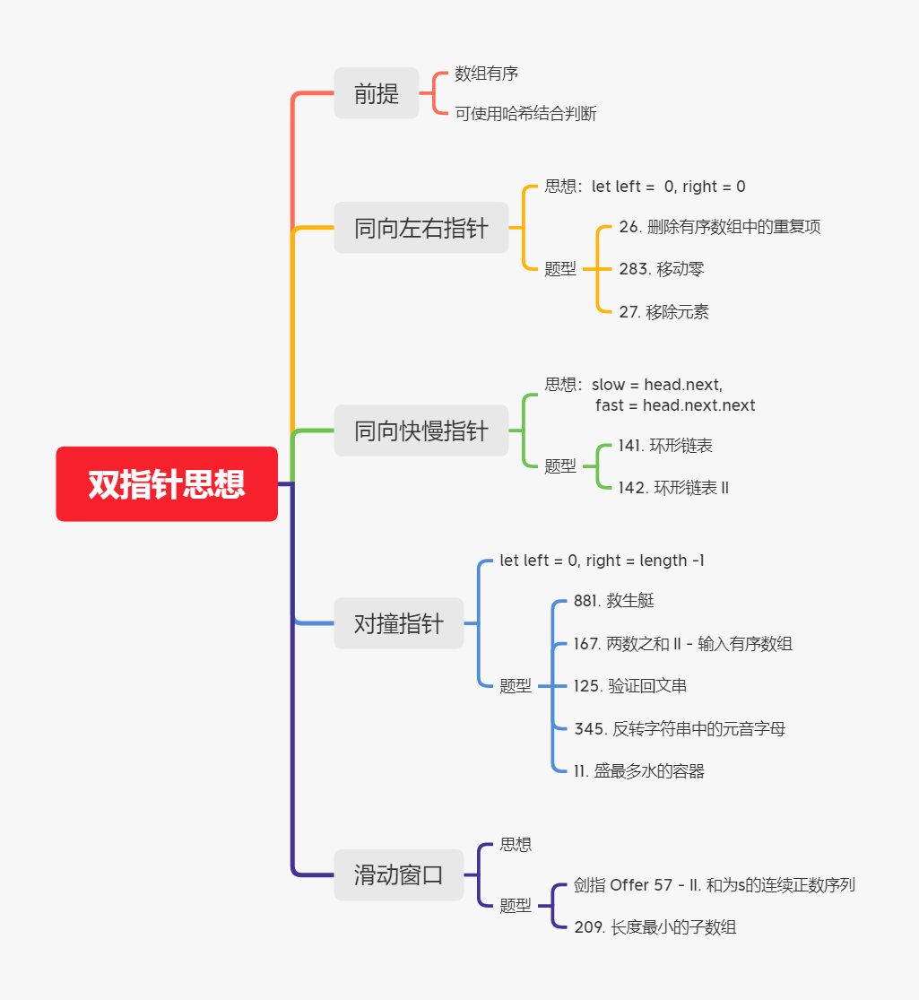

# 双指针算法



> https://www.bilibili.com/video/BV1sy4y1q79M?p=46

常用策略：

- 普通双指针：2个指针往同一个方向移动；
- 对撞指针：两个指针面对面移动 【**有序**数组题型】
- 快慢指针：快指针+慢指针【环形】

练习题：

- 26:  普通双指针
- 141：快慢指针
- 881：将无序转换成有序，将有序换成对撞指针
- 剑指 Offer 57 - II. 和为s的连续正数序列
----

## 双指针模板

### [剑指 Offer 57 - II. 和为s的连续正数序列](https://leetcode-cn.com/problems/he-wei-sde-lian-xu-zheng-shu-xu-lie-lcof/)

输入一个正整数 target ，输出所有和为 target 的连续正整数序列（至少含有两个数）。

序列内的数字由小到大排列，不同序列按照首个数字从小到大排列。

 

示例 1：

输入：target = 9
输出：[[2,3,4],[4,5]]
示例 2：

输入：target = 15
输出：[[1,2,3,4,5],[4,5,6],[7,8]]

```js
/**
 * @param {number} target
 * @return {number[][]}
 */
// 没有参照物数组 但是可以根据下标
// 滑动窗口（双指针）
var findContinuousSequence = function(target) {
    let l=1
    let r=2
    let sum = 3
    let res=[]
    // 滑动窗口框架
    while(l<r){
        if(sum===target){
            let ans =[]
            for(let k=l;k<=r;k++){
                ans[k-l]=k
            }
            res.push(ans)
            // 等于的情况 我们可以继续窗口往右搜索 同时缩小左边的
             sum=sum-l
             l++
        } else if(sum>target){
            // 大于的条件 缩小窗口 sum已经加过了
            sum=sum-l
            l++
        } else {
            // 小于的情况 滑动窗口继续扩大
            r++
            sum=sum+r
        }
    }
    return res
};

```

参考题解：[](https://leetcode-cn.com/problems/he-wei-sde-lian-xu-zheng-shu-xu-lie-lcof/solution/song-gei-qian-duan-tong-xue-tong-su-yi-d-u7z9/)

---


## 普通双指针

### [26. 删除有序数组中的重复项](https://leetcode-cn.com/problems/remove-duplicates-from-sorted-array/)


给你一个有序数组 nums ，请你 原地 删除重复出现的元素，使每个元素 只出现一次 ，返回删除后数组的新长度。

不要使用额外的数组空间，你必须在 原地 修改输入数组 并在使用 O(1) 额外空间的条件下完成。


说明:

为什么返回数值是整数，但输出的答案是数组呢?

请注意，输入数组是以「引用」方式传递的，这意味着在函数里修改输入数组对于调用者是可见的。

你可以想象内部操作如下:

// nums 是以“引用”方式传递的。也就是说，不对实参做任何拷贝
int len = removeDuplicates(nums);

// 在函数里修改输入数组对于调用者是可见的。
// 根据你的函数返回的长度, 它会打印出数组中 该长度范围内 的所有元素。
for (int i = 0; i < len; i++) {
    print(nums[i]);
}
 
示例 1：

输入：nums = [1,1,2]
输出：2, nums = [1,2]
解释：函数应该返回新的长度 2 ，并且原数组 nums 的前两个元素被修改为 1, 2 。不需要考虑数组中超出新长度后面的元素。
示例 2：

输入：nums = [0,0,1,1,1,2,2,3,3,4]
输出：5, nums = [0,1,2,3,4]
解释：函数应该返回新的长度 5 ， 并且原数组 nums 的前五个元素被修改为 0, 1, 2, 3, 4 。不需要考虑数组中超出新长度后面的元素。
 

提示：

0 <= nums.length <= 3 * 104
-104 <= nums[i] <= 104
nums 已按升序排列

---

- 方法：普通双指针-同向，利用数组有序
- 题解：

```js
/**
 * @param {number[]} nums
 * @return {number}
 */
var removeDuplicates = function(nums) {
    let n = nums.length
    let l = 0
    for (let r = 1; r < n; r ++) {
        if (nums[l] !== nums[r]) {
            nums[++l] = nums[r]
        }
    }
    return l + 1
};

```

参考资料：[双指针解删除有序数组中的重复项](https://mp.weixin.qq.com/s?__biz=MzU0ODMyNDk0Mw==&mid=2247490683&idx=1&sn=a9e7f705947bbad5a3fb98fdb664d828&chksm=fb418f5bcc36064d9d9535dc9b2176d66d8acf48ff8cd272c40e1e3ec68bf3d484fd235eaecd&token=1392348003&lang=zh_CN#rd)


## 快慢指针

### [141. 环形链表](https://leetcode-cn.com/problems/linked-list-cycle/)

难度简单

给定一个链表，判断链表中是否有环。

如果链表中有某个节点，可以通过连续跟踪 `next` 指针再次到达，则链表中存在环。 为了表示给定链表中的环，我们使用整数 `pos` 来表示链表尾连接到链表中的位置（索引从 0 开始）。 如果 `pos` 是 `-1`，则在该链表中没有环。**注意：`pos` 不作为参数进行传递**，仅仅是为了标识链表的实际情况。

如果链表中存在环，则返回 `true` 。 否则，返回 `false` 。

 

**进阶：**

你能用 *O(1)*（即，常量）内存解决此问题吗？

 

**示例 1：**


```
输入：head = [3,2,0,-4], pos = 1
输出：true
解释：链表中有一个环，其尾部连接到第二个节点。
```

**示例 2：**


```
输入：head = [1,2], pos = 0
输出：true
解释：链表中有一个环，其尾部连接到第一个节点。
```

**示例 3：**


```
输入：head = [1], pos = -1
输出：false
解释：链表中没有环。
```

 

**提示：**

- 链表中节点的数目范围是 `[0, 104]`
- `-105 <= Node.val <= 105`
- `pos` 为 `-1` 或者链表中的一个 **有效索引** 。

---

- 方法：快慢指针
- 题解：
- 答案

```js
/**
 * @param {ListNode} head
 * @return {boolean}
 */
var hasCycle = function(head) {
    if (!head) return false
    let slow = head, fast = head;
    while(fast && fast.next) {
        slow = slow.next
        fast = fast.next.next
        if (slow === fast) {
            return true
        }
    }
    return false
};
```


## 对撞指针

### [881. 救生艇](https://leetcode-cn.com/problems/boats-to-save-people/)

难度中等

第 `i` 个人的体重为 `people[i]`，每艘船可以承载的最大重量为 `limit`。

每艘船最多可同时载两人，但条件是这些人的重量之和最多为 `limit`。

返回载到每一个人所需的最小船数。(保证每个人都能被船载)。

 

**示例 1：**

```
输入：people = [1,2], limit = 3
输出：1
解释：1 艘船载 (1, 2)
```

**示例 2：**

```
输入：people = [3,2,2,1], limit = 3
输出：3
解释：3 艘船分别载 (1, 2), (2) 和 (3)
```

**示例 3：**

```
输入：people = [3,5,3,4], limit = 5
输出：4
解释：4 艘船分别载 (3), (3), (4), (5)
```

**提示：**

- `1 <= people.length <= 50000`
- `1 <= people[i] <= limit <= 30000`

---

- 方法：对撞指针
- 题解：
- 答案：

解法： 将数组转换成有序，使用对对撞指针


```js
/**
 * @param {number[]} people
 * @param {number} limit
 * @return {number}
 */
var numRescueBoats = function(people, limit) {
   if (!people || !people.length) return 0
    const arr = people.sort((a, b) => a - b)
    let left = 0, right = people.length - 1;
    let res = 0
    while(left <= right) {
        if (people[left] + people[right] <= limit) {
            left ++
        }
        right --
        res ++
    }
    return res
};
```

