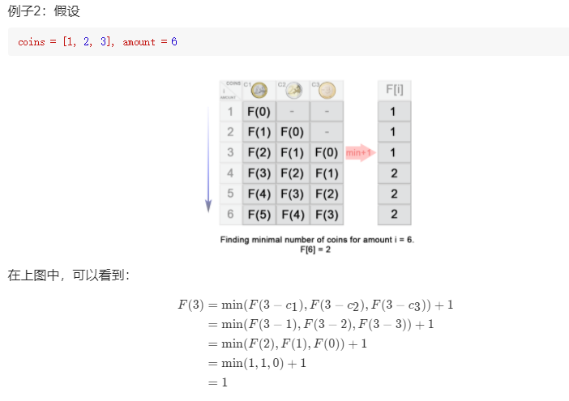

# 贪心算法思想

视频：https://www.bilibili.com/video/BV1sy4y1q79M?p=75

核心思想：

- 局部找到最优解，回溯法
- 合并所有局部解
- 得到全局最优解——答案


例题推荐：

- 322 零钱兑换
- 1217 玩筹码
- 55 跳跃游戏

---

## 题型一：

- [322. 零钱兑换](https://leetcode-cn.com/problems/coin-change/)

难度中等1145收藏分享切换为英文接收动态反馈

给定不同面额的硬币 `coins` 和一个总金额 `amount`。编写一个函数来计算可以凑成总金额所需的最少的硬币个数。如果没有任何一种硬币组合能组成总金额，返回 `-1`。

你可以认为每种硬币的数量是无限的。

 

**示例 1：**

```
输入：coins = [1, 2, 5], amount = 11
输出：3 
解释：11 = 5 + 5 + 1
```

**示例 2：**

```
输入：coins = [2], amount = 3
输出：-1
```

**示例 3：**

```
输入：coins = [1], amount = 0
输出：0
```

**示例 4：**

```
输入：coins = [1], amount = 1
输出：1
```

**示例 5：**

```
输入：coins = [1], amount = 2
输出：2
```

 

**提示：**

- `1 <= coins.length <= 12`
- `1 <= coins[i] <= 231 - 1`
- `0 <= amount <= 104`

---

- 视频：
- 题解：https://leetcode-cn.com/problems/coin-change/solution/

Code：

- 动态规划1


```js
/**
 * @param {number[]} coins
 * @param {number} amount
 * @return {number}
 */
var coinChange = function(coins, amount) {

        let res = new Array(amount + 1);
        res.fill(Infinity) //res数组除了第一个，后面都初始化为最大值
        res[0] = 0; //金额为0时，硬币数为0

        for(let i = 1;i<=amount;i++){
            for(let j = 0;j<coins.length;j++){
                //当前硬币小于等于金额，则当前硬币可以选择
                if(coins[j] <= i){
                    // 下面 2 行代码为核心代码：状态转移方程
                    //选了当前硬币，剩下的硬币数为 res[i - coins[j]]，当前总硬币数加一
                    const currentCoins = res[i - coins[j]] + 1;
                    //res数组记录最小的硬币数
                    res[i] = Math.min(res[i], currentCoins);
                }
            }
        }

        if(res[amount] == Infinity){
            return -1;
        }
        return res[amount];
 

};

```


- 动态规划2 https://leetcode-cn.com/problems/coin-change/solution/322-ling-qian-dui-huan-by-leetcode-solution/


```js
var coinChange = function(coins, amount) {
    let max = amount + 1
    const dp = new Array(amount + 1).fill(max)
    dp[0] = 0
    for (let i=1; i<= amount; i++) {
        for (let j=0; j< coins.length; j++) {
            if (coins[j] <= i) {
                dp[i] = Math.min(dp[i], dp[i - coins[j]] + 1)
            }
        }
    }
    return dp[amount] > amount ? -1 : dp[amount]
}

```




- 记忆化搜索：https://leetcode-cn.com/problems/coin-change/solution/322-ling-qian-dui-huan-by-leetcode-solution/


```js
var coinChange = function(coins, amount) {
    if (amount < 1) return 0

    return memorySearch(coins, amount, Array.from({length: amount}).fill(0)) // [1,2,5], 11, [0,0,0,0,0 ...]
}

function memorySearch (coins, rem, count) {
    if (rem < 0) return -1

    if (rem == 0) return 0

    // 每次遍历缓存值
    if (count[rem - 1] != 0) return count[rem -1]

    let min = Infinity

    for (let coin of coins) {
        let res = memorySearch(coins, rem - coin, count)
        if (res >= 0 && res < min) {
            min = 1 + res
        }
    }
    count[rem - 1] = min === Infinity ? -1 : min
    // 拿到 缓存过的值
    return count[rem -1]
}
```


- [1217. 玩筹码](https://leetcode-cn.com/problems/minimum-cost-to-move-chips-to-the-same-position/)

难度简单81

数轴上放置了一些筹码，每个筹码的位置存在数组 `chips` 当中。

你可以对 **任何筹码** 执行下面两种操作之一（**不限操作次数**，0 次也可以）：

- 将第 `i` 个筹码向左或者右移动 2 个单位，代价为 **0**。
- 将第 `i` 个筹码向左或者右移动 1 个单位，代价为 **1**。

最开始的时候，同一位置上也可能放着两个或者更多的筹码。

返回将所有筹码移动到同一位置（任意位置）上所需要的最小代价。

 

**示例 1：**

```
输入：chips = [1,2,3]
输出：1
解释：第二个筹码移动到位置三的代价是 1，第一个筹码移动到位置三的代价是 0，总代价为 1。
```

**示例 2：**

```
输入：chips = [2,2,2,3,3]
输出：2
解释：第四和第五个筹码移动到位置二的代价都是 1，所以最小总代价为 2。
```

 

**提示：**

- `1 <= chips.length <= 100`
- `1 <= chips[i] <= 10^9`

---

- 视频：
- 题解：https://leetcode-cn.com/problems/minimum-cost-to-move-chips-to-the-same-position/solution/yong-tan-xin-si-xiang-lai-zhao-gui-lu-chao-xiang-x/

Code：


```js
var minCostToMoveChips = function(position) {
    let odd = 0, even = 0

    for (let i=0; i< position.length; i++) {
        if (position[i] %2 == 0) even ++
        if (position[i] %2 !== 0) odd ++
    }

    return Math.min(even, odd)
};
```


- [55. 跳跃游戏](https://leetcode-cn.com/problems/jump-game/)

难度中等1100

给定一个非负整数数组 `nums` ，你最初位于数组的 **第一个下标** 。

数组中的每个元素代表你在该位置可以跳跃的最大长度。

判断你是否能够到达最后一个下标。

 

**示例 1：**

```
输入：nums = [2,3,1,1,4]
输出：true
解释：可以先跳 1 步，从下标 0 到达下标 1, 然后再从下标 1 跳 3 步到达最后一个下标。
```

**示例 2：**

```
输入：nums = [3,2,1,0,4]
输出：false
解释：无论怎样，总会到达下标为 3 的位置。但该下标的最大跳跃长度是 0 ， 所以永远不可能到达最后一个下标。
```

 

**提示：**

- `1 <= nums.length <= 3 * 104`
- `0 <= nums[i] <= 105`

---

- 视频：
- 题解：https://leetcode-cn.com/problems/jump-game/solution/55-by-ikaruga/

> 解题思路：
> 如果某一个作为 起跳点 的格子可以跳跃的距离是 3，那么表示后面 3 个格子都可以作为 起跳点。
> 可以对每一个能作为 起跳点 的格子都尝试跳一次，把 能跳到最远的距离 不断更新。
> 如果可以一直跳到最后，就成功了。
>
> 作者：ikaruga
> 链接：https://leetcode-cn.com/problems/jump-game/solution/55-by-ikaruga/
> 来源：力扣（LeetCode）
> 著作权归作者所有。商业转载请联系作者获得授权，非商业转载请注明出处。

Code：


```js
/**
 * @param {number[]} nums
 * @return {boolean}
 */
var canJump = function(nums) {
    //前n-1个元素能够跳到的最远距离
    let k = 0
    for (let i = 0; i <nums.length; i ++) {
        // 表示左边有一堵墙，左边任意节点，都不能跳到当前节点；我的理解为上一节点的最大步长跳不到 i 的位置
        if (k < i) return false
        //拿到 第i个元素能够跳到的最远距离 i + nums[i]，更新最远距离
        k = Math.max(k, i + nums[i])
    }
    return true
};
```


