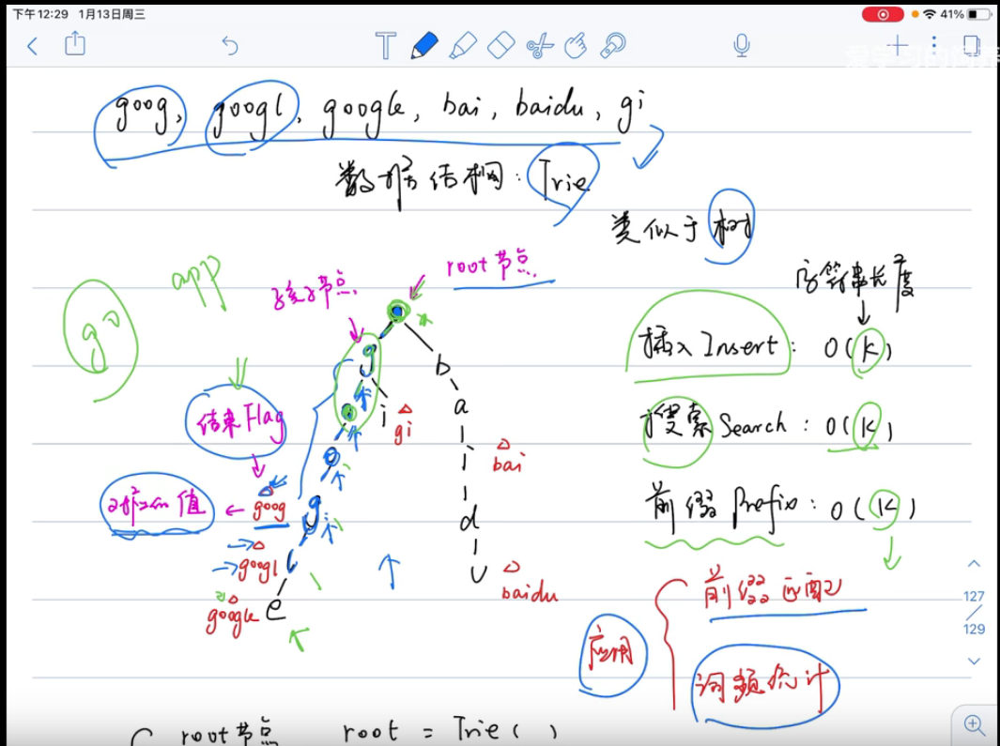
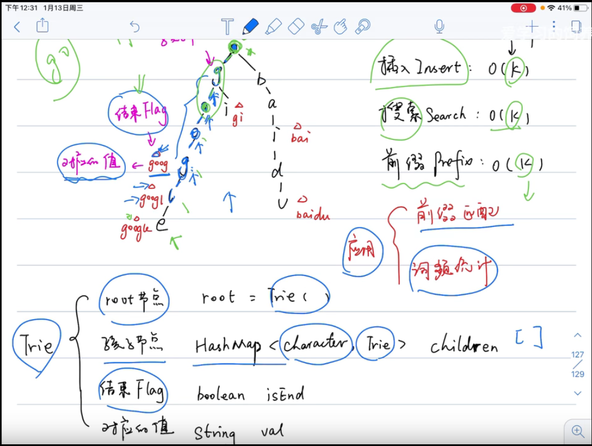
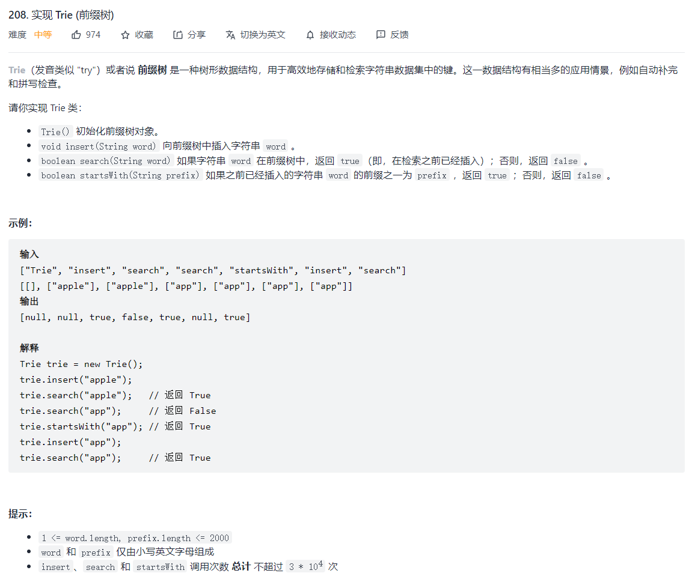
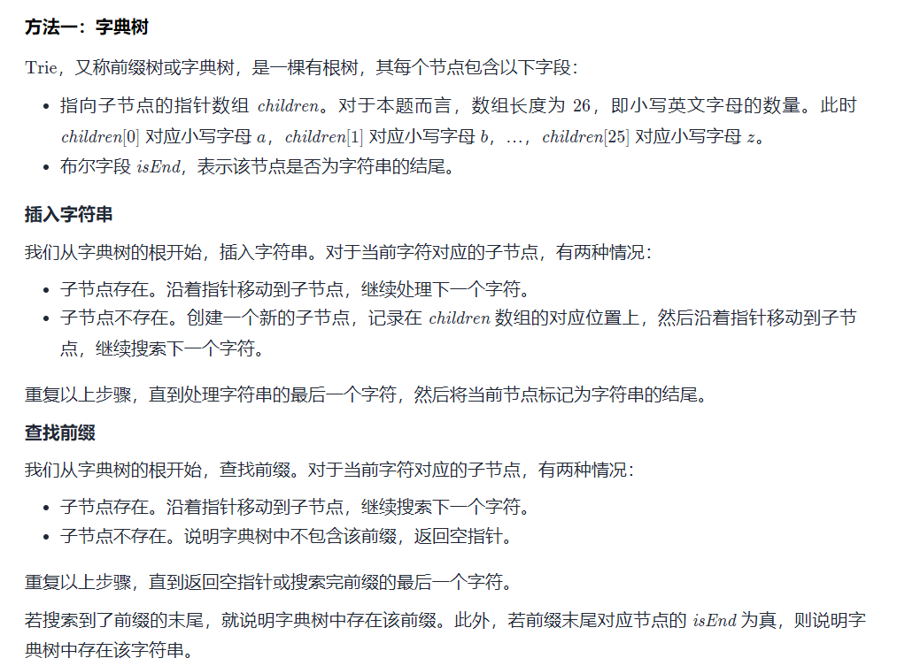
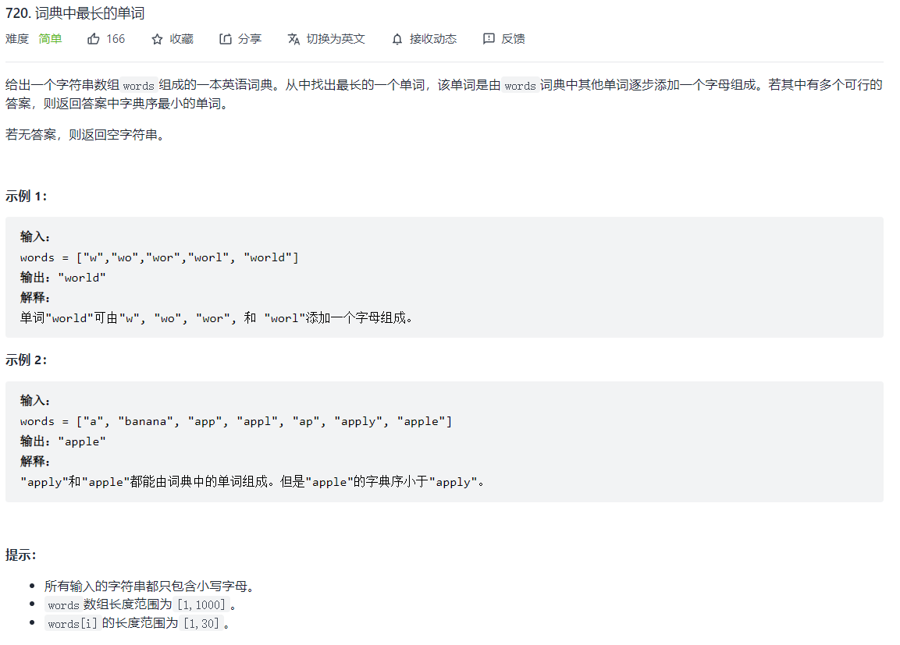

# 前缀树





推荐例题：

- 208 实现前缀树： 必须掌握，掌握后则其他题型套用即可
- 720 字典中最长的单词
- 692 前K个高频单词


----

- 208 实现前缀树




例子：我们要实现类似这种数据结构

```js
{
  'a': {
      'p': {
          'p': {
              'l': {
                  'e': {
                      'isEnd': 1,
                      'val': 'apple'
                    }
                }
            }
        }
    }
}

// 作者：xing-guang-29
// 链接：https://leetcode-cn.com/problems/implement-trie-prefix-tree/solution/208-shi-xian-trie-qian-zhui-shu-by-xing-8ufh8/
// 来源：力扣（LeetCode）
// 著作权归作者所有。商业转载请联系作者获得授权，非商业转载请注明出处。

```

题解：

```js
var Trie = function() {
    this.children = {};
};

Trie.prototype.insert = function(word) {
    let node = this.children;
    let val = ""
    for (const ch of word) {
        val += ch;
        if (!node[ch]) {
            node[ch] = { };
        }
        node = node[ch];
    }
    node.isEnd = true;
    node.val = val;
};

Trie.prototype.searchPrefix = function(prefix) {
    let node = this.children;
    for (const ch of prefix) {
        if (!node[ch]) {
            return false;
        }
        node = node[ch];
    }
    return node;
}

Trie.prototype.search = function(word) {
    const node = this.searchPrefix(word);
    return node !== undefined && node.isEnd !== undefined;
};

Trie.prototype.startsWith = function(prefix) {
    return this.searchPrefix(prefix);

  // 这种方式可以取出所有以 prefix 开始的值 
  // let objSource = this.searchPrefix(prefix);
  //   const fn = (objSource, result = []) => {
  //       Object.keys(objSource).forEach(k => {
  //           let temp = objSource[k]
  //           if (temp.isEnd) {
  //               result.push(temp.val)
  //           }
  //           if (typeof temp === 'object') {
  //               fn(temp, result)
  //           }
  //       })
  //       return result
  //   }
  //  return fn(objSource, [])
};

// let trie = new Trie();
// trie.insert("apple");
// trie.insert('application')
// trie.insert('apply')
// trie.insert('applyabc')
// let res = trie.startsWith("app")
// console.log('res', res)
// 
// res  ==>  ['apple', 'application', 'apply', 'applyabc']


// 作者：LeetCode-Solution
// 链接：https://leetcode-cn.com/problems/implement-trie-prefix-tree/solution/shi-xian-trie-qian-zhui-shu-by-leetcode-ti500/
// 来源：力扣（LeetCode）
// 著作权归作者所有。商业转载请联系作者获得授权，非商业转载请注明出处。

```


- 720 词典中最长的单词



解题思路：

- 前缀树 + dfs
- 哈希表

代码：前缀树 + dfs 方法

```js
var longestWord = function (words) {
    const trie = new Trie()
    words.forEach(word => {//将所有字符串插入trie中
        trie.insert(word)
    })
    let res = ''
    const _helper = (nodes, path) => {
        if (path.length > res.length || (res.length === path.length && res > path)) {
            res = path
        }
				//{a:{b1:{c1:{isEnd: true}},b2:{c2:{isEnd: true}}}}
        for (const [key, value] of Object.entries(nodes)) {        
            if (value.isEnd) {//如果当前字符是某一个字符串的结尾
                path += key
                _helper(value, path)//递归寻找
                path = path.slice(0, -1)//回溯
            }
        }
    }
    _helper(trie.children, '')//递归寻找那个长度最大的单词
    return res
}

var Trie = function() {
    this.children = {};
};

Trie.prototype.insert = function(word) {
    let nodes = this.children;
    for (const ch of word) {//循环word
        if (!nodes[ch]) {//当前字符不在子节点中 则创建一个子节点到children的响应位置
            nodes[ch] = {};
        }
        nodes = nodes[ch];//移动指针到下一个字符
    }
    nodes.isEnd = true;//字符是否结束
};


// 作者：chen-wei-f
// 链接：https://leetcode-cn.com/problems/longest-word-in-dictionary/solution/720-ci-dian-zhong-zui-chang-de-dan-ci-by-2k5k/
// 来源：力扣（LeetCode）
// 著作权归作者所有。商业转载请联系作者获得授权，非商业转载请注明出处。
```


代码：哈希表

```js
/**
 * @param {string[]} words
 * @return {string}
 */
var longestWord = function(words) {
  let res = ''
  let set = new Set(words)
  for(let w of words){
    if (w.length < res.length || w.length === res.length && w > res) continue
    let flag = true
    for(let i = 1; i < w.length; i++){  // 判断每个前缀是否在words中
      if (!set.has( w.slice(0, i) )) {
        flag = false
        break
      }
    }
    if (flag) res = w
  }
  return res
};

// 作者：shetia
// 链接：https://leetcode-cn.com/problems/longest-word-in-dictionary/solution/ci-dian-zhong-zui-chang-de-dan-ci-by-she-n4rf/
// 来源：力扣（LeetCode）
```

---

- 692 前k个高频单词

解题思路：

- 前缀树
- 哈希表 + 排序


代码：哈希表 + 排序

```js
/**
 * @param {string[]} words
 * @param {number} k
 * @return {string[]}
 */
var topKFrequent = function(words, k) {
    const map = {}
    for (let i of words) {
        map[i] ? map[i] += 1 : map[i] = 1
    }
   const idx = Object.entries(map).sort(([i1, v1], [i2,v2]) => (v2 - v1) || i1.localeCompare(i2)).slice(0, k)
   return idx.map(item => item[0])
};

// topKFrequent(["i", "love", "leetcode", "i", "love", "coding"], 3)
```