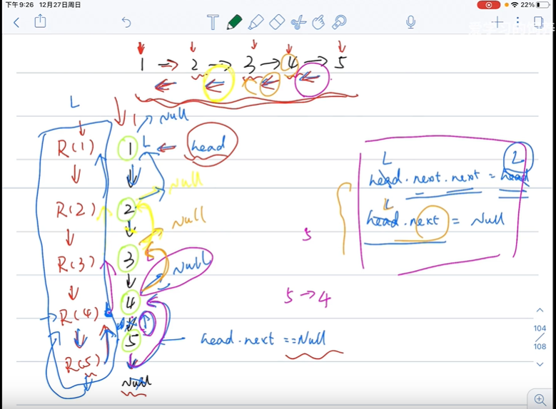

# 递归算法

自己调用自己，时间复杂度为 O(n)

视频：https://www.bilibili.com/video/BV1sy4y1q79M?p=57

**学习方法：需要自己动手画图理解思想**

例题：

- 509 斐波那契数
- 206 反转链表
- 344 反转字符串

递归算法四要素：

- 参数
- 终止条件
- 拆解
- 返回值


## 题型一

- [509. 斐波那契数](https://leetcode-cn.com/problems/fibonacci-number/)

难度简单

**斐波那契数**，通常用 `F(n)` 表示，形成的序列称为 **斐波那契数列** 。该数列由 `0` 和 `1` 开始，后面的每一项数字都是前面两项数字的和。也就是：

```
F(0) = 0，F(1) = 1
F(n) = F(n - 1) + F(n - 2)，其中 n > 1
```

给你 `n` ，请计算 `F(n)` 。

 

**示例 1：**

```
输入：2
输出：1
解释：F(2) = F(1) + F(0) = 1 + 0 = 1
```

**示例 2：**

```
输入：3
输出：2
解释：F(3) = F(2) + F(1) = 1 + 1 = 2
```

**示例 3：**

```
输入：4
输出：3
解释：F(4) = F(3) + F(2) = 2 + 1 = 3
```

 

**提示：**

- `0 <= n <= 30`

```js
/**
 * @param {number} n
 * @return {number}
 */
var fib = function(n) {

    if (n <2) {
        return n === 1 ? 1 : 0
    }

    const sum = fib(n-1) + fib(n-2)

  return sum
};
```


- [206. 反转链表](https://leetcode-cn.com/problems/reverse-linked-list/)

难度简单1691收藏分享切换为英文接收动态反馈

反转一个单链表。

**示例:**

```
输入: 1->2->3->4->5->NULL
输出: 5->4->3->2->1->NULL
```

**进阶:**
你可以迭代或递归地反转链表。你能否用两种方法解决这道题？

---

- 方法：

- 题解：

- 视频：https://www.bilibili.com/video/BV1sy4y1q79M?p=59

- 方法图：

  

- 答案：

迭代方法：


```js
**
 * Definition for singly-linked list.
 * function ListNode(val, next) {
 *     this.val = (val===undefined ? 0 : val)
 *     this.next = (next===undefined ? null : next)
 * }
 */
/**
 * @param {ListNode} head
 * @return {ListNode}
 */
var reverseList = function(head) {
  let dummy = new ListNode()
  dummy.next = head
  //dummy->1->2->3->4->5
  while (head && head.next) {
    let dnext = dummy.next
    let hnext = head.next
    // 暂存 2
    dummy.next = hnext
    // 1->2 ==> 1->3
    head.next = hnext.next
    // 2->3 ==> 2-> dummy 即 2->1
    hnext.next = dnext
  }
  return dummy.next
};
```


递归法：


```js
/**
 * Definition for singly-linked list.
 * function ListNode(val, next) {
 *     this.val = (val===undefined ? 0 : val)
 *     this.next = (next===undefined ? null : next)
 * }
 */
/**
 * @param {ListNode} head
 * @return {ListNode}
 */
var reverseList = function(head) {
    // 结束条件 节点为空，或者节点为最后一个链表节点，返回上一层 head
    if (!head || !head.next) return head

    const p = reverseList(head.next)

    head.next.next = head
    head.next = null
    
    return p
};
```


解释：

目的是反转，即： 

- 举例为： `4->5` 更改指向 `4->3` ，同时将 `3->4` 更改为 `3->null` 
- 即：改变自己的下一个指向后，将自己前面（上一个元素）的指向为 null
- 终止条件：元素为 null 或者下一个指向 为 null，则返回自己，结束递归

链表题目不是很好理解，最好画图帮助理解


- [344. 反转字符串](https://leetcode-cn.com/problems/reverse-string/)

难度简单368收藏分享切换为英文接收动态反馈

编写一个函数，其作用是将输入的字符串反转过来。输入字符串以字符数组 `char[]` 的形式给出。

不要给另外的数组分配额外的空间，你必须**[原地](https://baike.baidu.com/item/原地算法)修改输入数组**、使用 O(1) 的额外空间解决这一问题。

你可以假设数组中的所有字符都是 [ASCII](https://baike.baidu.com/item/ASCII) 码表中的可打印字符。

 

**示例 1：**

```
输入：["h","e","l","l","o"]
输出：["o","l","l","e","h"]
```

**示例 2：**

```
输入：["H","a","n","n","a","h"]
输出：["h","a","n","n","a","H"]
```

---

- 方法：
- 题解：
- 视频：https://www.bilibili.com/video/BV1sy4y1q79M?p=60
- 答案：
- 说明：递归方法有点取巧，值得反复看！！


```js

// 递归 法
var reverseString = function(s) {
    if (!s.length) return

    let l = 0, r = s.length -1

    const recurversion = (s, l, r) => {
        if (l >= r) return s

        recurversion(s, l+1, r-1)

        const temp = s[l]
        s[l] = s[r]
        s[r] = temp

    }

    recurversion(s, l, r)
}
```


也可以用双指针法：


```js
/**
 * @param {character[]} s
 * @return {void} Do not return anything, modify s in-place instead.
//  */
// 双指针方法
var reverseString = function(s) {
    if (!s.length) return

    let l = 0, r = s.length - 1

    const swap = (n1, n2) => {
        [s[n1], s[n2]] = [s[n2], s[n1]]
    }

    while(l<r) {
        swap(l, r)
        l ++
        r --
    }
    return s
};
```

