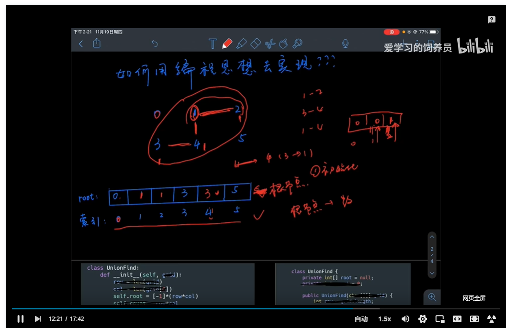

# 并查集算法思想

视频：https://www.bilibili.com/video/BV1sy4y1q79M?p=74

## 基础版本

本质：找 root 节点

2个方法：

- union：合并2 个元素，同一个根节点
- find：找到某个元素的根节点

使用：

```js
union(x, y)

find(x)
```

特点：模板化，基本题目都是套用同一个模板

理解：

生活中的例子：

- A司令——军长——团长A1-团长A2——士兵
- B司令——军长——团长B1-团长B2——士兵

合并后，只有一个司令，其他都是下属

常用工具：

- 数组：root - 索引



模板整理理解：

```js
// 并查集模板
class UniFind {
    root = []
    count = 0

    constructor(grid = [[]]) {
        const row = grid.length
        const col = grid[0].length

        this.count = row * col
        this.root = new Array(this.count)

        for (let i=0; i< this.count; i++) {
            this.root[i] = i
        }
    }
	// 递归找 root 索引
    find(x) {
        if (x === this.root[x]) {
            return x
        }
        //return this.root[x] = this.find(this.root[x])
        return this.root[x]
    }

	// 同化操作
    union(x = 0, y = 0) {
        const rootX = this.find(x)
        const rootY = this.find(y)

        if (rootX !== rootY) {
            this.root[rootX] = rootY
            this.count -= 1
        }
    }

    getCount() {
        return this.count
    }
}
```

练习题：

- 200 岛屿数量
- 547 省份数量


## 进阶版本

- find——> quickFind

快速找到 根节点 root：每次递归后，更改原来错误的 root，方便下一次查找

```js
// 递归找 root 索引
    find(x) {
        if (x === this.root[x]) {
            return x
        }
        // return this.root[x]
        return this.root[x] = this.find(this.root[x])
    }
```

- 路径压缩：权重法

例子：

2 棵不同高度的树合并，不是随意的直接合并，而是将 改动少的方案作为最有选择：高度少的树改动，高度多的不动。


---

## 题型一

- [200. 岛屿数量](https://leetcode-cn.com/problems/number-of-islands/)

难度中等

给你一个由 `'1'`（陆地）和 `'0'`（水）组成的的二维网格，请你计算网格中岛屿的数量。

岛屿总是被水包围，并且每座岛屿只能由水平方向和/或竖直方向上相邻的陆地连接形成。

此外，你可以假设该网格的四条边均被水包围。

 

**示例 1：**

```
输入：grid = [
  ["1","1","1","1","0"],
  ["1","1","0","1","0"],
  ["1","1","0","0","0"],
  ["0","0","0","0","0"]
]
输出：1
```

**示例 2：**

```
输入：grid = [
  ["1","1","0","0","0"],
  ["1","1","0","0","0"],
  ["0","0","1","0","0"],
  ["0","0","0","1","1"]
]
输出：3
```

 

**提示：**

- `m == grid.length`
- `n == grid[i].length`
- `1 <= m, n <= 300`
- `grid[i][j]` 的值为 `'0'` 或 `'1'`


---

- 视频：https://www.bilibili.com/video/BV1sy4y1q79M?p=69
- 题解：https://mp.weixin.qq.com/s/it_asGIDqQBoOrzdL1j2CQ
- 代码：


```js
var numIslands = function(grid) {
    if (grid === null || !grid.length) return 0

    let result = 0

    // 行数 
    const row = grid.length
    // 列数
    const col = grid[0].length

    let waters = 0

    const uf = new UniFind(grid)

    for (let i = 0; i < row; i++) {
            for (let j = 0; j < col; j++) {
                if (grid[i][j] == '0') {
                    waters++;
                } else {
                    const directions = [[0,1], [0, -1], [1, 0], [-1, 0]];
                    for (let dir of directions) {
                        const x = i + dir[0];
                        const y = j + dir[1];
                        if (x >= 0 && y >= 0 && x < row && y < col && grid[x][y] == '1') {
                            uf.union(x*col+y, i*col+j);
                        }
                    }
                }
            }
    }
    return uf.getCount() - waters;
    
}

class UniFind {
    root = []
    count = 0

    constructor(grid = [[]]) {
        const row = grid.length
        const col = grid[0].length

        this.count = row * col
        this.root = new Array(this.count)

        for (let i=0; i< this.count; i++) {
            this.root[i] = i
        }
    }

    find(x) {
        if (x === this.root[x]) {
            return x
        }
        return this.root[x] = this.find(this.root[x])
    }

    union(x = 0, y = 0) {
        const rootX = this.find(x)
        const rootY = this.find(y)

        if (rootX !== rootY) {
            this.root[rootX] = rootY
            this.count -= 1
        }
    }

    getCount() {
        return this.count
    }
}

```


- [547. 省份数量](https://leetcode-cn.com/problems/number-of-provinces/)

难度中等

有 `n` 个城市，其中一些彼此相连，另一些没有相连。如果城市 `a` 与城市 `b` 直接相连，且城市 `b` 与城市 `c` 直接相连，那么城市 `a` 与城市 `c` 间接相连。

**省份** 是一组直接或间接相连的城市，组内不含其他没有相连的城市。

给你一个 `n x n` 的矩阵 `isConnected` ，其中 `isConnected[i][j] = 1` 表示第 `i` 个城市和第 `j` 个城市直接相连，而 `isConnected[i][j] = 0` 表示二者不直接相连。

返回矩阵中 **省份** 的数量。

 

**示例 1：**


```
输入：isConnected = [[1,1,0],[1,1,0],[0,0,1]]
输出：2
```

**示例 2：**


```
输入：isConnected = [[1,0,0],[0,1,0],[0,0,1]]
输出：3
```

 

**提示：**

- `1 <= n <= 200`
- `n == isConnected.length`
- `n == isConnected[i].length`
- `isConnected[i][j]` 为 `1` 或 `0`
- `isConnected[i][i] == 1`
- `isConnected[i][j] == isConnected[j][i]`

---

- 视频：https://leetcode-cn.com/problems/number-of-provinces/solution/sheng-fen-shu-liang-by-leetcode-solution-eyk0/
- 题解：https://leetcode-cn.com/problems/number-of-provinces/solution/sheng-fen-shu-liang-by-leetcode-solution-eyk0/

参考leetcode 官方题解


- 方法1：并查集法

Code：


```js
var findCircleNum = function(isConnected) {
    const provinces = isConnected.length;
    const parent = new Array(provinces).fill(0).map((_, index) => index);

    for (let i = 0; i < provinces; i++) {
        for (let j = i + 1; j < provinces; j++) {
            if (isConnected[i][j] == 1) {
                // 找到城市，则为 父子关系
                union(parent, i, j);
            }
        }
    }
    let circles = 0;
    // union 完成以后，只有 father-城市 的 index 和 element 值 是相等的，因此只要遍历出 值即可
    parent.forEach((element, index) => {
        if (element === index) {
            circles++;
        }
    });

    return circles;
};

// 并操作
const union = (parent, index1, index2) => {
    parent[find(parent, index1)] = find(parent, index2);
}

// 查操作
const find = (parent, index) => {
    // 若没找到，则改变经过路径的 父节点值
    if (parent[index] !== index) {
        parent[index] = find(parent, parent[index]);
    }
    // 若找到，直接返回
    return parent[index];
}
```


- 方法2：DFS 


```js
var findCircleNum = function(isConnected) {
    const provinces = isConnected.length;
    const visited = new Set();
    let circles = 0;
    for (let i = 0; i < provinces; i++) {
        if (!visited.has(i)) {
            dfs(isConnected, visited, provinces, i);
            circles++;
        }
    }
    return circles;
};

const dfs = (isConnected, visited, provinces, i) => {
    for (let j = 0; j < provinces; j++) {
        if (isConnected[i][j] == 1 && !visited.has(j)) {
            visited.add(j);
            dfs(isConnected, visited, provinces, j);
        }
    }
};
```


